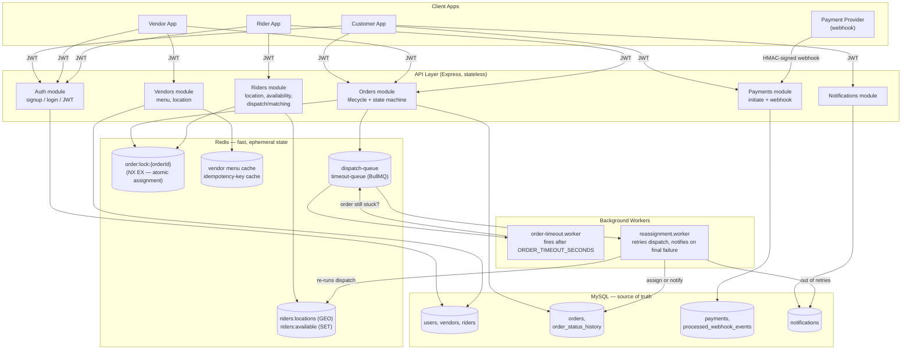
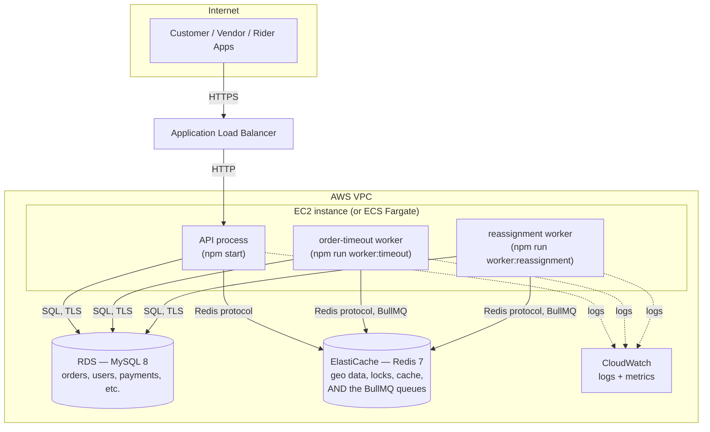

# Dispatch Backend

A scaled-down version of a delivery-dispatch platform like Chowdeck: one backend serving a **customer app**, a **vendor app**, and a **rider app**, coordinating an order through its full lifecycle in real time, including live rider matching, atomic assignment under concurrency, idempotent payment webhooks, and automatic reassignment when a rider can't be found in time.

**Stack:** Node.js (Express) · MySQL · Redis · BullMQ · AWS

---

## Why this project exists

This is a portfolio project built to demonstrate backend engineering judgment on a problem with real distributed-systems edges. The interesting parts aren't the endpoints; they're the places where naive implementations quietly break in production:

- What happens when **two orders try to grab the same available rider at the same instant**?
- What happens when a **payment provider retries a webhook** because it didn't get a `200` in time?
- What happens when a **customer double-clicks "place order"** on a bad connection?
- What happens when **no rider is available** does the order just vanish into a black hole?
- What happens when a **rider goes offline mid-request**, or a **DB write fails after a Redis lock is already taken**?

Each of those has a concrete answer in this codebase, and the sections below walk through what it is and why. If you're reviewing this as a hiring exercise: the "Technical decisions" and "What I'd add with more time" sections below are written specifically for yo

---

## Quickstart

```bash
git clone <this-repo>
cd dispatch-backend
npm install
cp .env.example .env          # fill in real values, see "Environment variables" below
docker compose up -d           # local MySQL 8 + Redis 7
npm run migrate                # applies all migrations
npm run seed                   # one test customer, vendor, rider
npm start                      # API on http://localhost:3000
```

In separate terminals, run the two background workers (see [Background workers](#background-workers)):

```bash
npm run worker:timeout
npm run worker:reassignment
```

Verify it's alive:

```bash
curl localhost:3000/health
# {"status":"ok"}
```

Run the test suite:

```bash
npm test
```

---

## Environment variables

Copy `.env.example` to `.env` and fill in real values. Required unless marked optional:

| Variable                                                            | Purpose                                                                                   |
| ------------------------------------------------------------------- | ----------------------------------------------------------------------------------------- |
| `PORT`                                                            | Port the API listens on                                                                   |
| `DB_HOST`, `DB_PORT`, `DB_USER`, `DB_PASSWORD`, `DB_NAME` | MySQL connection                                                                          |
| `REDIS_HOST`, `REDIS_PORT`                                      | Redis connection                                                                          |
| `REDIS_PASSWORD`                                                  | *(optional)* Redis auth, if your instance requires it                                   |
| `JWT_SECRET`                                                      | Signs/verifies auth tokens                                                                |
| `WEBHOOK_SECRET`                                                  | HMAC key for validating payment webhook signatures                                        |
| `ORDER_TIMEOUT_SECONDS`                                           | *(optional, default 30)* How long to wait for a rider before triggering reassignment    |
| `REASSIGN_MAX_ATTEMPTS`                                           | *(optional, default 5)* How many times the reassignment worker retries before giving up |
| `REASSIGN_RETRY_DELAY_SECONDS`                                    | *(optional, default 15)* Delay between reassignment retries                             |

A note on Redis: if you're pointing at a managed instance (e.g. Redis Cloud), set its **eviction policy to `noeviction`** in its console. BullMQ needs this — under `volatile-lru` or similar, Redis can silently evict queue data under memory pressure and jobs disappear without error.

---

## System architecture

Three client apps talk to one stateless API layer. MySQL is the durable source of truth; Redis holds fast, ephemeral operational state (live rider locations, assignment locks, caches, and the BullMQ job queues). Two background workers handle anything that shouldn't block an HTTP response.



### Order lifecycle walkthrough

1. **Customer** places an order → `POST /orders` → row in `orders` (`placed`) + first `order_status_history` entry, both in one transaction.
2. **Vendor** accepts → `PATCH /orders/:id/vendor-response` → status → `vendor_accepted`. This single request also, synchronously:
   - schedules a delayed `order-timeout` job (`ORDER_TIMEOUT_SECONDS` out), and
   - runs dispatch immediately: `GEOSEARCH` for nearby available riders → tries to atomically lock + claim the nearest one → assigns if successful.
3. If a rider is locked in step 2, the order becomes `rider_assigned` and the timeout job becomes a no-op when it fires (it checks the order's current status first).
4. If **no rider was available**, the order stays `vendor_accepted`. When the timeout fires, `order-timeout.worker` enqueues a `reassign-order` job with a retry policy (`REASSIGN_MAX_ATTEMPTS`, fixed backoff). `reassignment.worker` re-runs dispatch on each retry.
5. If every retry is exhausted with no rider found, the worker writes a **notification row** for both the customer and the vendor, telling them to cancel and (for the customer) request a refund, surfaced via `GET /notifications`.
6. **Rider** transitions `picked_up` → `delivered`; every transition is validated against a single state-machine module (`order.state-machine.js`) and written to `order_status_history`. On `delivered`, the rider is returned to the Redis available pool.
7. **Payment webhook** arrives independently at any point, validated by HMAC signature and de-duplicated by `event_id` against `processed_webhook_events` in the same transaction as the status update, a provider retry can't double-process.
8. **Customer cancel** (`PATCH /orders/:id/cancel`) is available from any pre-delivery state; if a rider was already assigned, cancelling releases them back to the pool.

### Where state lives

|                | MySQL                                                                                                                                                   | Redis                                                                                                                                                  |
| -------------- | ------------------------------------------------------------------------------------------------------------------------------------------------------- | ------------------------------------------------------------------------------------------------------------------------------------------------------ |
| **What** | `users`, `vendors`, `riders`, `orders`, `order_status_history`, `payments`, `processed_webhook_events`, `menu_items`, `notifications` | rider geolocation (`GEOADD`/`GEOSEARCH`), available-rider set, per-order assignment locks, vendor menu cache, idempotency-key cache, BullMQ queues |
| **Why**  | Durable, relational, the record of what actually happened                                                                                               | Fast, ephemeral, cheap to recompute or safely lose                                                                                                     |

Rule of thumb used throughout: **if losing it on restart would corrupt the record of what happened, it's MySQL. If it's a live signal that's cheap to recompute, it's Redis.**

---

## Infrastructure architecture

For the demo, everything runs via `docker-compose.yml` (local MySQL 8 + Redis 7). The design targets this AWS shape, which is what production would look like without changing any application code — Redis and MySQL connection details are entirely environment-variable-driven:



Key points:

- **There is no separate "BullMQ instance."** BullMQ is a Node library, not a server — it stores queue state as data structures inside Redis itself. This is why the worker processes and the API process both connect to the *same* ElastiCache Redis cluster: the queue is just more keys in that Redis instance, alongside the geo data and locks. This is a common point of confusion worth calling out explicitly, since the architecture doc's phrasing ("Redis-backed BullMQ queues") can make it sound like a fourth infrastructure piece — it isn't.
- **API and workers are separate OS processes**, not separate code paths triggered by request handling. A slow reassignment retry or a stuck timeout check never blocks a customer's `POST /orders` call, because it isn't running in the same event loop. In ECS this would map cleanly to two separate services (or task definitions) sharing one task role and one set of environment variables.
- **The API layer is stateless** — no session affinity needed, since all real state lives in RDS/ElastiCache. This means it can run behind an ALB with multiple instances/tasks without any code change.
- **Workers scale independently of the API.** If reassignment backs up under load, you scale worker replicas without touching the API tier at all.
- **RDS and ElastiCache both need `noeviction`/appropriate durability settings for their roles** — this matters more for ElastiCache than a typical cache, since it's also holding queue data that must not silently disappear.

---

## Technical decisions and trade-offs

This section is aimed at anyone reviewing the code who wants to understand *why* it's shaped this way, not just what it does.

### Why plain SQL migrations + a hand-written runner, instead of an ORM/migration framework

A ~15-line runner script (`migrations/migrate.js`) that tracks applied files in a `schema_migrations` table does everything an ORM's migration tool would for a project this size, with zero abstraction to learn and every generated SQL statement fully visible. The trade-off: no down-migrations, no schema-diffing. For a project of this scope that's the right trade — for a larger team-maintained system, I'd reach for a real tool (Knex, Prisma Migrate) specifically for down-migrations and multi-environment promotion workflows.

### Why UUIDs instead of auto-increment integers for primary keys

Every `id` in this schema (except the internal `schema_migrations` table) is a `CHAR(36)` UUID generated by MySQL 8's `DEFAULT (UUID())`. This was a direct decision partway through the build (see the migration history — `users.id` started as `INT AUTO_INCREMENT` and was changed). Trade-off accepted: UUIDs are less index-efficient than sequential integers at very large scale, and 36-byte keys cost more storage/index space than 4-byte ints. What that buys back: IDs are never sequential/guessable (an attacker can't enumerate `/orders/1`, `/orders/2`, ...), and IDs can be generated client-side or across services without a round-trip, which matters the moment you have more than one write path.

### Why the assignment lock is a Redis `SET ... NX EX`, not a MySQL row lock

`SET order:lock:{orderId} riderId NX EX 10` is a single atomic Redis operation — either you got the lock or you didn't, and it self-expires if a process crashes mid-assignment. Doing the equivalent with `SELECT ... FOR UPDATE` in MySQL works too, but ties up a DB connection and transaction for the whole matching window, under load. Given dispatch already needs Redis (for `GEOSEARCH`), keeping the lock in the same system avoids a cross-system consistency question entirely.

### Why riders are claimed with `SREM`'s return value, not a check-then-act

The naive version — "check if the rider is in the available set, then assign them" — has a race: two orders can both pass the check before either writes. `SREM` is atomic and returns exactly how many elements it removed. Only the caller that gets `1` back actually owns the rider; a caller that gets `0` knows someone else got there first and moves to the next candidate. This is the same pattern as the assignment lock: push the race condition into a single atomic primitive instead of trying to reason about timing.

### Why payments are fully mocked instead of integrating Paystack/Flutterwave sandbox

The reason that drove this specifically asks for a mock provider reference, and the interesting engineering here, the payment row lifecycle, HMAC signature validation, and idempotent webhook processing keyed on `event_id` is identical regardless of which provider sits behind it. A real integration would mean an account, API keys, and a public tunnel (ngrok) just to receive callbacks, none of which demonstrates additional backend design skill; it just adds setup friction and an external dependency the tests can't run against offline. Swapping in a real provider later touches exactly two functions (`initiatePayment`, the webhook controller), the transaction logic and the schema are provider-agnostic by design.

### Why idempotency is handled two different ways

`POST /orders` uses an **`Idempotency-Key` header cached in Redis** (client-driven — the client decides what counts as "the same request", useful for retry-on-timeout scenarios where the client can't tell if the first request succeeded). The payment **webhook** uses **`event_id` uniqueness enforced by a MySQL constraint inside the same transaction as the state change** (server-driven — the event's own identity is authoritative, and the guarantee needs to survive concurrent delivery, which a Redis cache with a TTL doesn't guarantee as strongly as a DB unique constraint plus row lock). Same underlying problem, two different correctness requirements, two different mechanisms — using one pattern everywhere would have been simpler to write but wrong for at least one of the two cases.

### Why validation is a middleware + schema, not inline `if` checks

Early tasks used hand-written `if (!field)` checks in controllers. Once the surface area grew past a handful of endpoints, these got replaced with Zod schemas run through a single `validate(schema)` middleware, which:

- centralizes the error shape (`400` with per-field `details`) instead of re-inventing it per endpoint,
- lets validated output replace `req.body`, so controllers can trust their input's shape and stop null-checking,
- keeps the webhook's signature check ordered *before* schema validation — an unauthenticated caller must never learn what the expected payload shape is, even from a `400`.

### Why dispatch, the timeout worker, and the reassignment worker are three separate pieces instead of one big function

`dispatchOrder` (geosearch → lock → claim → assign) is called from two different places: synchronously inside the vendor-accept request, and later from the reassignment worker on retry. Keeping it as one function that both call means the matching logic — and its correctness guarantees around locking — only has to be right once.

### Why response shapes were normalized to always return the full DB row

Early order-mutating endpoints returned different hand-built partial objects (`{id, status, riderId}` from one, the full row from another). This was fixed once it surfaced as a real inconsistency during integration testing (see `order.repository.js` — `updateOrderStatus` and `assignRiderToOrder` both return the same shape as `createOrder`/`getOrderById` now). Worth naming explicitly: this is the kind of drift that's easy to introduce incrementally and easy to miss until something actually consumes two endpoints and compares their output.

---

## API reference

All endpoints except `GET /health`, `GET /vendors/:id/menu-items`, `POST /auth/signup`, and `POST /auth/login` require `Authorization: Bearer <JWT>`.

| Method | Path                                | Role                                        | Purpose                                                                         |
| ------ | ----------------------------------- | ------------------------------------------- | ------------------------------------------------------------------------------- |
| GET    | `/health`                         | —                                          | Liveness check                                                                  |
| POST   | `/auth/signup`                    | —                                          | Create account (auto-creates`vendors`/`riders` profile row for those roles) |
| POST   | `/auth/login`                     | —                                          | Returns a JWT                                                                   |
| POST   | `/orders`                         | customer                                    | Create an order (`Idempotency-Key` header supported)                          |
| GET    | `/orders/:id`                     | owner (customer/vendor/rider on that order) | Order + full status history                                                     |
| PATCH  | `/orders/:id/vendor-response`     | vendor (owner)                              | Accept or reject; accept triggers dispatch                                      |
| PATCH  | `/orders/:id/rider-status`        | rider (assigned)                            | `picked_up` / `delivered`                                                   |
| PATCH  | `/orders/:id/cancel`              | customer (owner)                            | Cancel; frees an assigned rider                                                 |
| POST   | `/orders/:id/pay`                 | customer (owner)                            | Initiate a mock payment                                                         |
| POST   | `/webhooks/payments`              | — (HMAC-signed)                            | Payment provider callback, idempotent                                           |
| POST   | `/riders/:id/location`            | rider (owner)                               | Update live GPS location                                                        |
| PATCH  | `/riders/:id/availability`        | rider (owner)                               | Toggle online/offline                                                           |
| GET    | `/vendors/:id/menu-items`         | —                                          | Browse a vendor's menu                                                          |
| POST   | `/vendors/:id/menu-items`         | vendor (owner)                              | Add a menu item                                                                 |
| PATCH  | `/vendors/:id/menu-items/:itemId` | vendor (owner)                              | Edit a menu item                                                                |
| PATCH  | `/vendors/:id/location`           | vendor (owner)                              | Set the vendor's dispatch origin point                                          |
| GET    | `/notifications`                  | any authenticated user                      | Notifications addressed to you                                                  |

---

## Background workers

Two long-running processes, separate from the API:

- **`npm run worker:timeout`** (`src/workers/order-timeout.worker.js`): consumes delayed jobs from `timeout-queue`. If an order is still `vendor_accepted` when its timeout fires, enqueues a `reassign-order` job with a retry policy.
- **`npm run worker:reassignment`** (`src/workers/reassignment.worker.js`): consumes `reassign-order` jobs from `dispatch-queue`, re-runs the same `dispatchOrder` matching logic used on initial accept. Throws on failure to find a rider, which triggers BullMQ's built-in retry/backoff; once retries are exhausted, writes notification rows for the customer and vendor.

Both must be running for the timeout → retry → notify path to work; the API itself only *enqueues*, it never processes these jobs inline.

---

## Testing

- **`npm test`** — `node --test`, runs `tests/order-lifecycle.test.js`: a full signup → login → create → accept → dispatch → pickup → delivered flow against the real Express app (in-process, random port), asserting status and full history at every step.
- **`scripts/`** — a set of standalone integration scripts written during development for pieces that are awkward to assert via HTTP alone (concurrent-lock races, Redis geo queries, queue retry timing, cache hit/miss behavior). Each is runnable directly, e.g. `node scripts/test-rider-busy.js`, and each is self-contained with its own pass/fail output. These aren't wired into `npm test` — they're closer to focused diagnostic harnesses than a CI-friendly suite, which is exactly the kind of gap called out below.

---

## What I'd add with more time

Every item below was a deliberate "not now" decision, not an oversight:

- **A real payment gateway integration** (Paystack/Flutterwave sandbox), swapping into the existing mock's two integration points, once there's a use case that needs real money to move.
- **Vendor/order ETA via a routing API** (Google Maps), since the current `GEOSEARCH` matching is straight-line distance, not actual drive time — fine for "who's nearest," not accurate for "how long until pickup."
- **A refund flow.** Cancellation notifications currently tell a customer to request a refund, but there's no endpoint to actually process one — this only becomes meaningful once payments are real.
- **Consolidate the `scripts/` diagnostics into the `npm test` suite**, or at least a documented "integration" test tier that CI can run against a real (containerized) MySQL + Redis, rather than requiring a developer to run them by hand against their local `.env`.
- **Push notifications instead of DB-polled notifications** — `GET /notifications` today requires the client to poll; a webhook/SSE/push mechanism would make the "no rider found" alert actually real-time.
- **Refresh tokens and token revocation.** JWTs today are stateless with a fixed 1-day expiry and no revocation path — fine for a demo, not for production auth.
- **Rate limiting**, especially on `/auth/login` and the webhook endpoint.
- **Structured logging** (pino/winston with request IDs) instead of `console.log`/`console.error`, so worker and API logs can be correlated per-order in CloudWatch.
- **An admin/ops view** for stuck orders right now, an order that exhausted reassignment retries is only visible via its notification rows or a direct DB query; there's no dashboard.
- **Down-migrations**, for safer rollback in a real deployment pipeline.
- **Payments are also missing a real distinction** between "the rider was already delivering and hasn't marked delivered yet" vs. "cancel with rider mid-route", the current state machine allows both, worth a product decision on whether it should.
